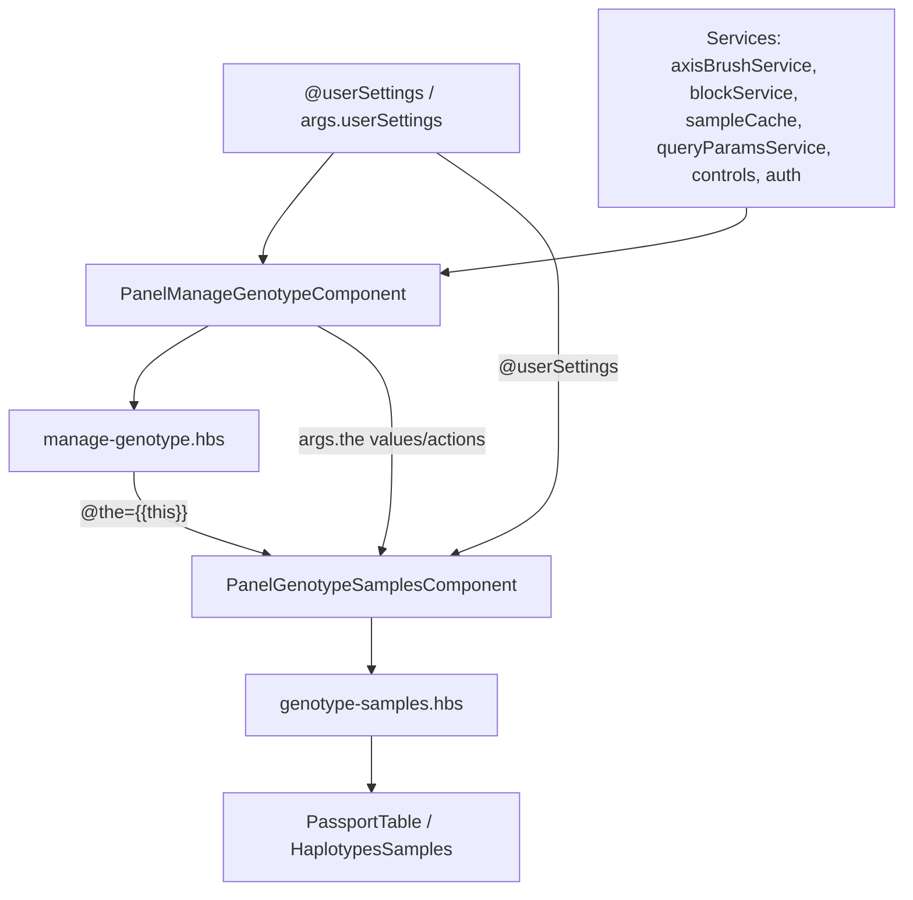
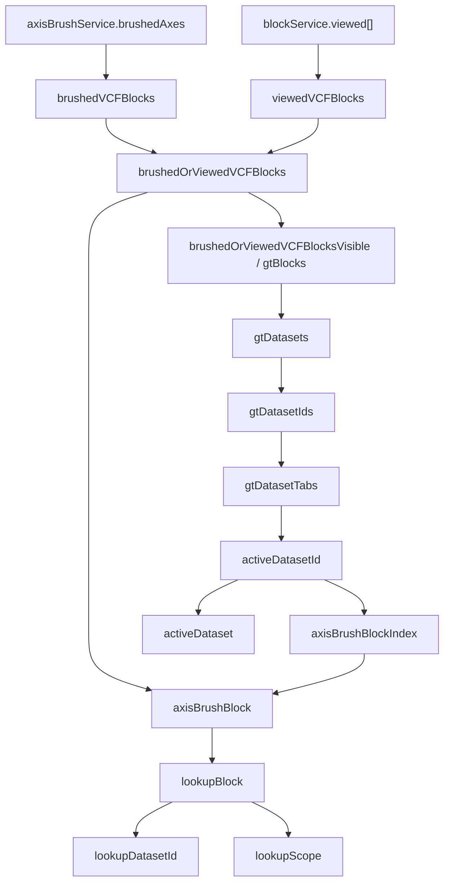
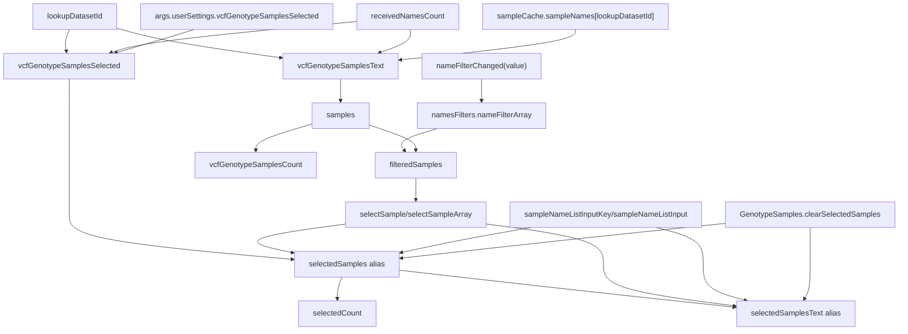
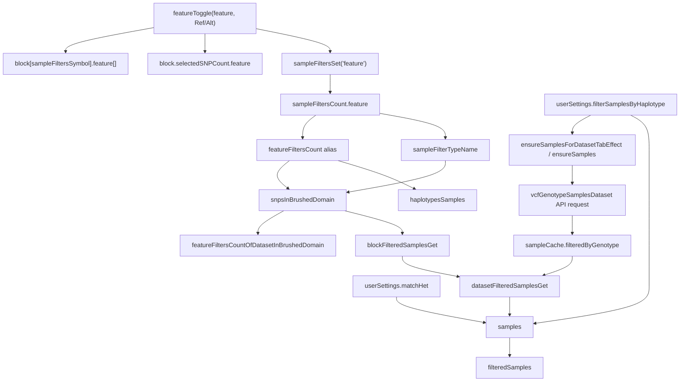
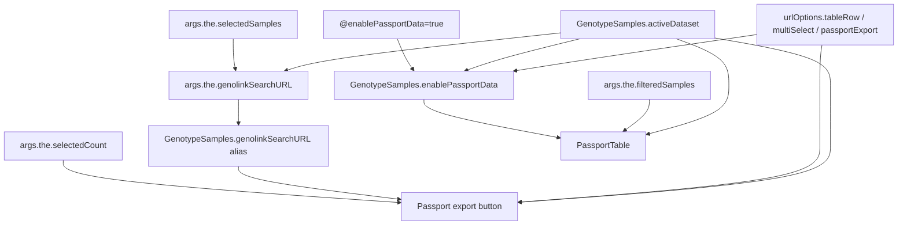

# Genotype Samples Data Flow

This note maps the tracked and computed state used by:

- `frontend/app/components/panel/manage-genotype.js`
- `frontend/app/components/panel/manage-genotype.hbs`
- `frontend/app/components/panel/genotype-samples.js`
- `frontend/app/components/panel/genotype-samples.hbs`

`Panel::ManageGenotype` owns almost all state. `Panel::GenotypeSamples` receives
that owner as `@the={{this}}`, reads most values through `args.the`, and exposes a
small set of wrapper getters/actions for the sample-selection UI.

The GitNexus index was available but stale at the time this note was written, so
the graph below is source-derived rather than graph-index-derived.

## High Level Ownership



## Main Reactive State

| Owner | Kind | Property | Main dependencies | Main consumers |
| --- | --- | --- | --- | --- |
| ManageGenotype | tracked | `activeId`, `activeIdDatasets`, `activeDatasetId`, `activeDataset` | tab actions `onChangeTab()`, `selectDataset()`, `setSelectedDataset()` | dataset tabs, `GenotypeSamples.activeDataset`, `genolinkSearchURL` |
| ManageGenotype | tracked | `receivedNamesCount` | incremented after sample-list API response | `vcfGenotypeSamplesText`, `vcfGenotypeSamplesSelected`, `samples`, `lookupBlockSamples` |
| ManageGenotype | tracked | `sampleFiltersCount` | `featureToggle()`, `sampleFiltersSet()` | `featureFiltersCount`, `sampleFiltersCountSelected`, SNP/haplotype filter UI |
| ManageGenotype | alias | `vcfGenotypeSamplesSelectedAll` | `args.userSettings.vcfGenotypeSamplesSelected` | per-dataset selected sample storage |
| ManageGenotype | computed | `vcfGenotypeSamplesText` | `lookupDatasetId`, `receivedNamesCount`, `sampleCache.sampleNames` | `samples`, sample-list request state |
| ManageGenotype | computed | `vcfGenotypeSamplesSelected` | `lookupDatasetId`, `receivedNamesCount`, `vcfGenotypeSamplesSelectedAll` | alias `selectedSamples`, lookup button, selected count |
| ManageGenotype | alias | `selectedSamples` | `vcfGenotypeSamplesSelected` | sample select, textarea, Genolink URL |
| ManageGenotype | reads | `selectedCount` | `selectedSamples.length` | tab badges, buttons |
| ManageGenotype | alias | `selectedSamplesText` | `args.userSettings.selectedSamplesText` | sample textarea |
| ManageGenotype | computed | `samples` | `vcfGenotypeSamplesText`, `samplesIntersection`, `filterSamplesByHaplotype`, `matchHet`, `snpsInBrushedDomain.length`, `sampleCache.filteredByGenotypeCount`, `lookupBlock`, `receivedNamesCount` | `vcfGenotypeSamplesCount`, `filteredSamples`, lookup request sampling |
| ManageGenotype | computed | `filteredSamples` | `samples`, `namesFilters.nameFilterArray` | sample select list, PassportTable samples, clipboard |
| ManageGenotype | computed | `featureFiltersCountOfDatasetInBrushedDomain` | `lookupDatasetId`, `block.brushedDomain`, `featureFiltersCount`, `sampleFilterTypeName`, `selectedSNPsInBrush` | haplotype filter checkbox state/count |
| ManageGenotype | computed | `haplotypesSamples` | `lookupBlock.brushedDomain`, `featureFiltersCount` | `Panel::HaplotypesSamples` loader |
| GenotypeSamples | alias | `urlOptions` | `queryParamsService.urlOptions` | conditional UI |
| GenotypeSamples | computed getter | `activeDataset` | `args.the.activeDataset` fallback to `args.the.lookupBlock.datasetId.content` | passport enablement, passport export |
| GenotypeSamples | computed getter | `enablePassportData` | `args.enablePassportData`, `activeDataset.isGenolink`, `urlOptions.tableRow`, `urlOptions.multiSelect` | switch between select list and `PassportTable` |
| GenotypeSamples | getter/setter | `matchExactAlleles` | inverse of `args.userSettings.matchHet` | "Match exact alleles" checkbox |
| GenotypeSamples | alias | `genolinkSearchURL` | `args.the.genolinkSearchURL` | Genolink button |

## Dataset And Lookup Selection



Dataset tab selection flows through `selectDataset(datasetId)`, which sets the
axis/block index via `mut_axisBrushBlockIndex(i)` and then sets
`activeDatasetId`, `activeIdDatasets`, and `activeDataset` via
`setSelectedDataset(datasetId)`.

## Sample List And Selected Samples



Important mutation points:

- `vcfGenotypeSamplesDataset(vcfBlock)` writes sample names to
  `sampleCache.sampleNames[datasetId]` for unfiltered results, writes filtered
  samples to `sampleCache.filteredByGenotype[block.id][filterDescription]`, and
  increments `receivedNamesCount`.
- `selectSampleArray(selectedSamples, add)` mutates both `selectedSamples` and
  `selectedSamplesText`.
- `sampleNameListInputKey(value)` updates `selectedSamplesText` on every edit and
  reparses to `selectedSamples` when the line count changes.
- `GenotypeSamples.clearSelectedSamples()` clears `args.the.selectedSamples` and
  `args.the.selectedSamplesText`.

## Haplotype / SNP Filter Flow



The "Match exact alleles" checkbox in `genotype-samples.hbs` is intentionally
inverted:

```text
GenotypeSamples.matchExactAlleles = ! args.userSettings.matchHet
```

When checked, the setter writes `args.userSettings.matchHet = false`.

## Passport / Genolink Flow



`enablePassportData` selects between the ordinary multi-select sample list and
`PassportTable`. It is true only for Genolink datasets when `tableRow` or
`multiSelect` URL options are enabled.

## Template Read Surface

The components' templates mostly read this smaller surface:

- `manage-genotype.hbs`: `showInputDialog`, `activeId`, `activeIdDatasets`,
  `activeDatasetId`, `gtDatasetTabs`, `selectedCount`, `brushedDomainLength`,
  `vcfGenotypeTextSizeDescription`, `vcfGenotypeLookupCount`,
  `vcfGenotypeText.length`, `urlOptions`, `apiServerSelectedOrPrimary`,
  `axisBrushService.brushedAxes`, `referenceDatasetName`,
  `requestSamplesSelected`, `snpsInBrushedDomain`,
  `featureFiltersCount`, `brushedOrViewedVCFBlocks.length`,
  `ensureSamplesForDatasetTabEffect`.
- `genotype-samples.hbs`: `@the.vcfGenotypeSamplesCount`,
  `@the.featureFiltersCountOfDatasetInBrushedDomain`,
  `@the.featureFiltersCount`, `this.matchExactAlleles`,
  `@the.sampleFiltersCountSelected`, `@the.haplotypesSamples`,
  `@the.samplesRequestDescription`, `this.enablePassportData`,
  `@the.sampleNameFilter`, `@the.namesFilters.nameFilterArray`,
  `@the.filteredSamples`, `@the.filterErrorText`, `this.activeDataset`,
  `@the.selectedSamples`, `@the.selectedCount`, `@the.selectedSamplesText`,
  `this.genolinkSearchURL`, `this.urlOptions`.

## Notes And Edges To Watch

- `genotype-samples.hbs` reads `@the.sampleNameFilter`, but
  `manage-genotype.js` mutates `namesFilters` through `nameFilterChanged(value)`.
  The effective reactive dependency for filtering is
  `namesFilters.nameFilterArray`.
- `samplesRequestDescription` is written with `Ember_set()` in
  `vcfGenotypeSamplesDataset()`, but is not declared as a tracked field in this
  component.
- `genolinkSearchURL` sets `searchIdsTruncatedMessage` on
  `PanelManageGenotypeComponent`; `genotype-samples.hbs` reads
  `this.searchIdsTruncatedMessage`, not `@the.searchIdsTruncatedMessage`.
- Several computed properties are used for side effects in templates:
  `selectedSampleEffect`, `sampleFiltersCopyEffect`, and
  `ensureSamplesForDatasetTabEffect`.
