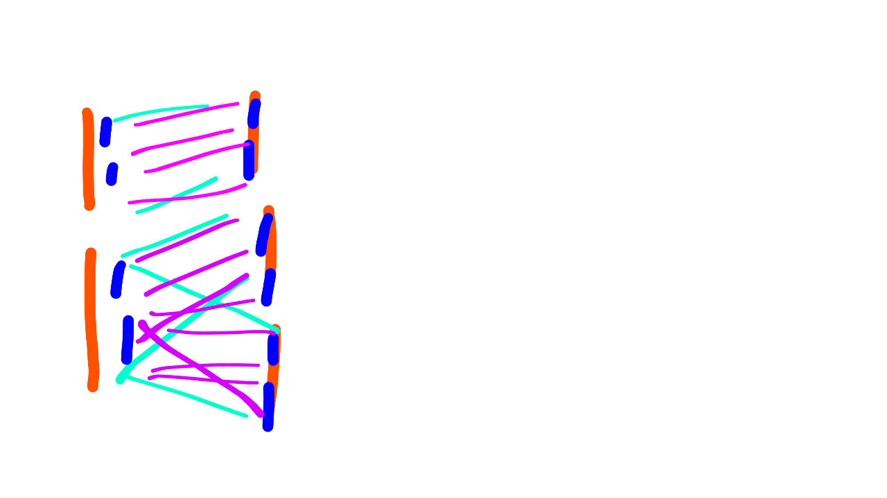
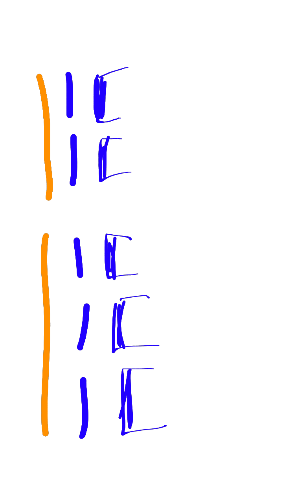

# Introduction

The data transferred from backend server to frontend application is normally in large blocks, mostly regular format.
Using a JSON data format provides flexibility and extensibility - we can introduce arbitrary data elements within the structure which are understood by some part of the frontend, but the remainder of the modules can transport the data without concern for the format variation.

## Target platforms

The application is intended to function on a number of platforms, e.g.
* personal use on a laptop, running db, backend and frontend, possibly offline
* departmental use : a fast server running db and backend, with users running the frontend on destops and laptops
* remote data sources : users may access db+backend via the web, with the frontend served either from a web-site
or running as a locally installed web-app.

## Scaleable Design

To handle the large data sets while providing good performance for the user, efficient design choices are required in these areas :

### API
progressive enhancement, increasing detail with zoom level, filtering, pagination, 

### data processing
Given that the backend may have much more processing capability than the frontend, some calculations will be best done on the backend and the results sent to the frontend app.  Mongodb/Mongoose have advanced filterining capabilities, and these can be leveraged for enhanced performance.
The time to transmit the result data may be similar to the frontend calculation time, depending on the how fine the filter is.

These filters may be expressed as a generic qualifier added to the request URL, e.g. /percent=10,interlace/

### DOM updates
The DOM is able to display more information than a user can absorb;  the key is to design the data visualisation update to fit the users's visual bandwidth and the network bandwidth / CPU processing power.

A useful analogy is the design of google maps update, which is crafted to provide just the data which will add to the current view.
Similarly, the plan for our application :
*  data applicable to the users's requested zoom level is requested, and displayed as it arrives.
The data may be thinned (e.g. interlaced % of data), or a higher-level representation shown (synteny blocks instead of gene/marker paths).
So the initial 100% view of a chromosome would only require a small fraction of the chromosome's data.
*  render is async from user scroll & zoom, render trails behind user requests
*  at any point user can save URL (shared, it will recreate the view)
*  data is cached in frontend, so that scrolling / zooming back to previous view is quick

* reduced data representation in transition :
 e.g. when dragging an axis, there is limited benefit in displaying all the paths attached to the axis; options are to display higher-level info such as synteny blocks, or a percentage of the paths, or transition the paths back to their home axis until the drag is complete, then come out again, like a coral polyp.

# Promises / Render and backend-frontend API

These 2 topics are interconnected by requirements and design considerations.

### overview of scope :
- backend processing as an alternative to front-end calculation of routes / paths between adjacent APs.
- also how to update the APs without changing the route so the addition of an AP or the deletion of an AP
  will not cause a re-render, will only re-render the particular AP.

### Terms :
<dl>
  <dt>AP</dt>
  <dd>Axis Piece, i.e. a genetic map or a chromosome.</dd>
</dl>

## Promises / Render 

When the URL is interpreted it causes a re-render because of the refreshModel flags being true for
the map and chromosome in the configuration.
The re-render is desired, so that works.  Change would be in that
currently the pull-down menu has linkTos
and also the chromosome-Delete has a linkTo,
so those, instead of being URLs which would cause a re-render,
should be ember-concurrency requests to
get the extra data and then just do the calculations for that data and render that data.

Currently the collateData() and flow collateStacks() calculations work for all 
APs in one go; they need to be able to operate for just a single new AP
assuming that all the others are still there.
Looking at collateData(), it processes each AP individually so processing just 1 (new) AP should be OK.
For collateStacks(), it applies when there is a new adjacency,
which there will be if there is a new AP.
Possibly either split out those functions so they can handle just one new AP
or 1 new adjacency
or as they are calculating, check to see if that calculation has been done before by
seeing if the corresponding hash member has been defined.

At the moment 
that lookup would be just based on the AP id but in future
we would also want to split it based on a range of locations;
that's both for the collateData() and collateStacks();
for collateStacks() it would be for ranges of locations on each of
the adjacent APs.

In terms of the rendering and transition -
the component of data which is requested needs to be rendered in a separate group (SVG <g>)
(so each data from each response can be inserted without disrupting previous elements).
We already have a group per-AP;
we would also need a group per APxAP,
that is the adjacencies between AP A and B would need to named (the group would be named) "A_B".

Looking forward - if we are requesting multiple pages, i.e. use the progressive interleave for example,
then those page numbers would need to be part of the group class also.

## backend-frontend API

Looking on the backend,
we want to be able to replicate the adjacency calculation on the back-end, preferably using mongo search capabilities where possible.
The types of searches would be :
- all adjacencies between AP A & B,
with the possibility to define a range of locations on both A & B
- the adjacency might also be via the aliases of A & B
- and may be restricted to only unique aliases

Back-end can also work out syntenic blocks.
Synteny is a relationship between 2 APs, so when synteny is requested between A & B,
the back-end would, if it hasn't already cached that value, calculate it, cache it and
return it.

Synteny would also be possibly constrained by range of locations on A & B.
Check whether synteny is via the gene/marker name or via its aliases,
or possibly via either.
The result is the syntenic blocks, which is a much smaller adjacency that the full list of paths
connecting the two.
The range specified in requesting adjacency between A & B
may also indicate the range via the syntenic block on each of those APs.

Factors affecting whether to get from the back-end or calculate on the front-end :
- the richness of connections adjacency;
for example there may be very few interconnections between 2 APs,
or there may be a large number, which would favour calculation on the front-end.
- comms bandwidth between backend and frontend, relative to CPU power & memory

The grouping of adjacency results by syntenic block or by location range,
and also by a pair of adjacent APs, would be by classes rather than ID,
and each of those could be a separate class with a prefix to indicate its type,
the type being e.g. syntenic block id range or pair, location range pair, AP id pair;
the syntenic block and location range are relative to an AP id.
So the front end will have a representation of what is currently visible,
i.e. the list of APs and for each AP the range of locations or a syntenic block,
also the order of the APs, which will indicate the adjacency;
the order can include stacks.  This is essentially the URL.
That determines the range of data which is displayed;
i.e. what is passed to the d3 data function.
So the group element is a hierarchy of ranges,
and then the data function for each range will calculate the list of data values.

Received data can be displayed in a transition whose length (of time) is determined
by the time interval between 
the previous 2 responses received.
The initial transition time can be just an estimate or 0.

## Plan

The complexity of this will impact on when it should be done because it adds to the
usability of the application rather than the functionality.

The most beneficial application of calculating adjacencies on the backend would be the
unique alias calculation, so that is the best place to start.
That would be for the whole AP, i.e. requesting all (unique or non-unique) alias adjacencies between APs A & B,
no sub-ranges or syntenic blocks.

The syntenic block calculation is also a good one, but there is
significant work on the front-end to represent those syntenic blocks.

## Syntenic Blocks Representation / GUI

A block could be represented by a pair of paths, i.e. 2 connections between the 2 adjacent APs,
which uses the existing software on the front-end, doesn't require any new rendering capability.

On the front-end these pairs can be flagged as groups,
i.e. the start and end of the syntenic block can be grouped together so that it can be coloured
differently to the other blocks.

The syntenic block calculation doesn't seem to be something which can be done with mongo search facilities;
it would have to be a JavaScript algorithm.
The synteny calculation would have counters for the number of contiguous exceptions
the number of total allowed exceptions,
within 1 block.

On the front-end the selection of whether to display syntenic blocks or paths,
be they direct or aliases or unique aliases etc,
is currently slightly controlled at the graph level,
but it could be valuable to control it
per adjacent pair of APs.

It could also be automatic that when a new AP is added,
initially just the syntenic blocks are shown and then, per user request or when the user zooms in,
the next level of detail is shown automatically,
i.e. the actual paths.

Aside : also want to be able to zoom in by mouse scroll-wheel - e.g. hover the mouse over an axis, scroll wheel will zoom in/out that axis, centred on the position of the cursor on the axis.

To zoom in via syntenic block selection : 2 possibilities
- select a syntenic block on one axis and zoom just that axis
- select the adjacency of a syntenic block, and zoom the axis
at both ends of the adjacency, i.e. both APs.

The latter seems more useful;
otherwise you would have a single syntenic block on one end and then the whole AP / the whole chromosome on the other end;
there wouldn't be much value in that because all the lines outside of the syntenic block on the other end would not be connected.

So we need some representation of the syntenic block which the user can hover over to access a menu;
possibly a rectangle on the axis.
The block could be represented by a parallelogram, which would be a change of implementation.
but would offer a good hover ability, and colouration.

### Selecting a pair of adjacent APs, or a synteny block

(just bouncing around some ideas and issues - not a plan)

Possibly split up the foreground <g> into multiple groups, 1 per adjacency;
have to check on the impact on clipping;
also this means that
groups will be replicated in multiple foreground sections,
although it is not necessary for all the groups to be moved into those foreground sections;
the sub-sections / the adjacency foreground groups could be used simply for
catching click actions for a hover/pop-up menu which controlled the level of detail for that adjacency
e.g. syntenic blocks / aliases / directs etc.

But considering a stack of 2 APs to a stack of 3,
where would you click to select the adjacency between 1 AP and another ?
So instead : have the ability to select APs and for the adjacency of the most recent 2 APs selected,
the status can be displayed and set;
status being the level of detail displayed, whether it be syntenic blocks / etc.

The adjacency of a syntenic block
may have an inversion,
so selecting that would be difficult because of the bow-tie appearance,
so it is better to select the syntenic block by the rectangle representation at either end.
Display of the hover menu over one end of a syntenic block can
highlight the other end of the syntenic block
to indicate that both ends are affected by the hover menu actions.

Considered having a wedge shape at the edge of the axis
representing the synteny block, which could be selected,
but the same problem arises with stacks,
e.g. if you have got a 2 x 3 stack and you trying to
select the synteny blocks they'll overlap, as they would if the
wedge idea was used to select adjacent axis pairs.
So simply
select the 2 axes, and the most recent 2 axes selected are displayed
in the bottom section;
similarly for synteny blocks, and there the status is displayed and can be changed.

alternative representations for synteny blocks :
- curved-edge like a [Sankey Diagram](https://bost.ocks.org/mike/sankey/ "Example of Sankey Diagram")
- selecting AP : perhaps a rectangular region projecting into the foreground section, like synteny blocks.
- synteny blocks : just short rectangular pieces, open ended, thick inside edge and no outside edge / border.

