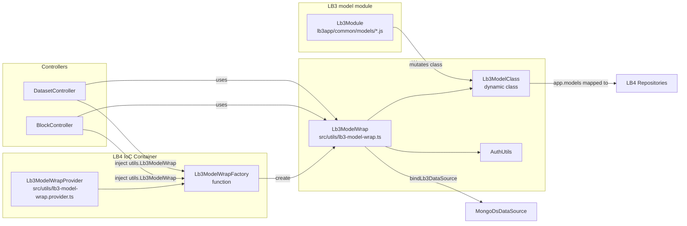

# LoopBack v3 → v4 model migration process (Block + Dataset)

This summarizes the working pattern used to migrate LB3 models (Block, Dataset) into LB4 while preserving legacy LB3 remoteMethod behavior. Use this as a template for other models.

---

## 1) Keep LB3 model logic but expose via LB4 controllers

### Approach
- Keep the LB3 model files (`lb3app/common/models/*.js`) untouched where possible.
- In LB4, add endpoints in `src/controllers/*.controller.ts` that call the LB3 static functions.
- Use a wrapper that binds:
  - `dataSource.connector`
  - `app.models` (mapped to LB4 repositories)
  - a shared `lb3Call()` to wrap callback-based LB3 functions into Promises.

### Implementation
- Create `src/utils/lb3-model-wrap.ts` with:
  - `model` (LB3 class instance)
  - `authUtils` (shared LB4 auth)
  - `bindLb3DataSource()`
  - `lb3Call<T>()`
- Provide a DI factory `src/utils/lb3-model-wrap.provider.ts`:
  - `Lb3ModelWrapProvider` returns a factory function
  - Default `app.models` uses LB4 repositories: `Block`, `Dataset`, `Feature`, `Client`, `Group`, `ClientGroup`, `Alias`, `Annotation`, `Interval`
- Bind provider in `src/application.ts`:
  ```ts
  this.bind('utils.Lb3ModelWrap').toProvider(Lb3ModelWrapProvider);
  ```

### Controller pattern
- Inject `Lb3ModelWrapFactory`:
  ```ts
  @inject('utils.Lb3ModelWrap') private lb3WrapFactory: Lb3ModelWrapFactory
  ```
- Create wrapper instance:
  ```ts
  this.lb3 = this.lb3WrapFactory(Lb3Module);
  ```
- For each LB3 remoteMethod, add LB4 endpoint:
  ```ts
  this.lb3.bindLb3DataSource();
  return this.lb3.lb3Call(cb => this.lb3.model.someMethod(args..., cb));
  ```

---

## 2) Authorization reuse

### AuthUtils
- Centralized in `src/utils/auth.ts`.
- Provides:
  - `authorizeBlocksRead(...)`
  - `authorizeDatasetRead(...)`
  - `authorizeDatasetClientGroupsRead(...)` (internal)
  - `enforceScopedBlockAccess()`

### Applied in controllers
- Block endpoints: use `authorizeBlocksRead` or `enforceScopedBlockAccess`.
- Dataset endpoints: use `authorizeDatasetRead(datasetId)` when datasetId is the auth boundary.

---

## 3) Repository hooks (LB3 observe → LB4 overrides)

LB3 `Block.observe('before save'|'before delete'|'after save')` does not translate directly in LB4. Interceptors on repositories don’t fire in practice. Solution: override repository CRUD methods.

### Implemented in `src/repositories/block.repository.ts`
- Override:
  - `create`
  - `updateById`
  - `replaceById`
  - `deleteById`
  - `deleteAll`
- Behaviors preserved:
  - **before save**: set `name` from `scope` or `namespace` if missing
  - **before delete**: delete related `Feature`, `Annotation`, `Interval`
  - **after save**: clear cached block features (uses LB3 `block-features` + `results-cache`)

---

## 4) Client group cache (LB3 client-groups.js)

LB3 used `observe` to update a cached mapping of:
- `groups[ groupId ]`
- `clientGroups[ clientId ]`

LB4 replacement:
- New `src/utils/client-groups.ts` with:
  - `init(dataSource)`
  - `update()`
  - `updateWithGroupIds()`
- App start calls `clientGroups.init(mongoDs)`.
- `ClientGroupRepository` and `GroupRepository` override `create/updateById/replaceById/deleteById` to call `clientGroups.update()`.

---

## 5) SSE endpoints

LB3 `pathsViaStream` and `pathsAliasesViaStream` depend on raw `req/res` and `express-sse`.

LB4 approach:
- Add LB4 endpoints that pass `req/res` into LB3 methods.
- Return `Response` from controller so LB4 doesn’t auto-end the stream.

---

## 6) LB3 boot/middleware compatibility

### Boot logic reused
- `lb3app/server/environment.js`
- `lb3app/server/boot/exception_handling.js`
- `lb3app/server/boot/frontend-environment.js`

Wrapped in `src/lb3-compat/boot.ts` and called from `src/application.ts`.

### LB3 middleware reused
- `lb3app/server/middleware/route_time.js`
- `lb3app/server/middleware/memcache.js`

Wrapped in `src/middleware/lb3-*.middleware.ts` and applied in `src/application.ts` with a path check for `/api/Blocks/*`.

---

## 7) Dataset upload fix (LB4 rejects navigational props)

LB4 repositories reject nested relations in `.create()`. LB3 upload sent `data.blocks` directly.

Fix in `lb3app/common/utilities/upload.js`:
- Extract `data.blocks` before `Dataset.create()`
- Strip `annotations/intervals/features` before `Block.createAll()`
- Preserve nested data separately for later creation
- Use mapping by `block.name || block.scope` to avoid order mismatch when creating blocks

---

## 8) Dataset LB3 remoteMethods added

In `src/controllers/dataset.controller.ts`:
- `loadFromURL`
- `vcfGenotypeFeaturesCountsStatus` (with `authorizeDatasetRead` + `noCacheResult`)
- `upload`
- `tableUpload`
- `createComplete`
- `cacheClear`
- `cacheblocksFeaturesCounts`
- `naturalSearch`
- `text2Commands`
- `getEmbeddings`

Pattern identical to Block controller.

---

## 9) Testing

- Added acceptance test for block hooks: `src/__tests__/acceptance/block-interceptor.acceptance.ts`
- Supports external API via `API_BASE_URL` and `AUTH_TOKEN`.

---

## 10) Lb3ModelWrap diagram (provider/factory/wrapper usage)



Key flow:
- Controllers inject the factory (`utils.Lb3ModelWrap`) and request a wrapper for a specific LB3 module.
- The wrapper builds a dynamic `Lb3ModelClass`, applies the LB3 module to it, and wires `app.models` to LB4 repositories.
- Controllers call `wrap.bindLb3DataSource()` and then invoke LB3 methods via `wrap.lb3Call(...)`.

---

## Template for new model migration

1. Keep LB3 model file unchanged.
2. Add LB4 controller endpoints using `Lb3ModelWrap`.
3. Map `app.models` to relevant repositories.
4. Apply `AuthUtils` checks.
5. Port LB3 `observe()` hooks by overriding repository CRUD methods.
6. Add tests + minimal curl scripts.
